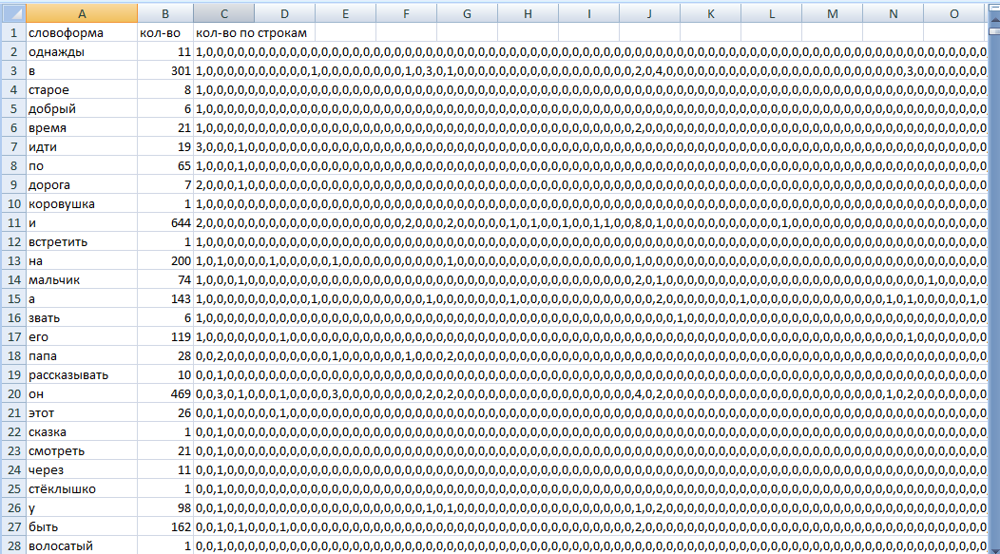

## Тестовое задание

При запросе к /public/report/export возвращается Excel-файл формата .xlsx, содержащий частотную статистику словоформ из загруженного текстового файла любого размера. Для каждой словоформы (с учётом приведения слов к одной форме) в отчёте формируется строка с тремя столбцами: словоформа, общее количество её вхождений во всём документе, а также количество вхождений в каждой строке исходного файла, представленное в виде строки чисел, разделённых запятыми (например: 0,11,32,0,0,3).

Для анализа словоформ использовал **pymorphy3**.

Покрытие тестами - 93%

Запуск:
```console
$ poetry run uvicorn app.main:app --host 0.0.0.0 --port 8000
```

Или
```console
$ docker compose up
```

Результат для тестового файла ([сама таблица](./example-data/result.xlsx)): 



#### Общее описание работы:
Присланный файл читается по частям (размер части регулируется переменной UPLOAD_CHUNK_SIZE_MB), далее для каждой части собирается статистика в воркере из пула процессов или потоков, эта статистика сохраняется в базу, как во временное хранилище. После обработки всех частей, собранная статистика читается из базы и собирается в xlsx-файл, который отправляется обратно.

#### Дополнительные возможности:
- ограничение на размер отправляемого файла
- healthcheck

